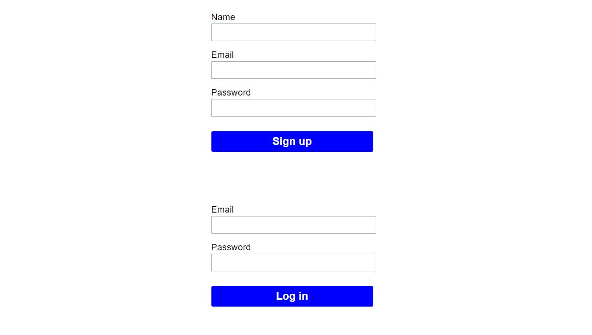

# JWT Auth Boilerplate with React & Redux-Saga

JSON Web Token authentication boilerplate built on the MERN stack

### Get Started:
* Clone this repo, make sure to npm install in both the server and client.  
`git clone git@github.com:scott-ammon/jwt-auth-boilerplate.git <directory-name>`
* Create a .env file in the project directory with a `JWT_SECRET=<YOUR SECRET>`
* Add a `PORT=<WHATEVER PORT YOU WANT>` to the .env. Alternatively, 3001 will be used.
* Start the mongo server (typically `mongod` from your shell if you've set up the alias).
* Create a db called jwtAuth. If you have the alias set up you can use `mongo` to start the MongoDB CLI in a new shell, and type `use jwtAuth` to create the db. Alternatively, rename the db in the server-side index.js in the `mongoose.connect()` function. 
* `npm run build` to run react-scripts to build your React app
* Navigate back up to the project level directory and `npm start`

#### This auth flow was created with:
* Mongoose (MongoDB)
* Express
* React
* Redux
* Redux-saga
* Node

